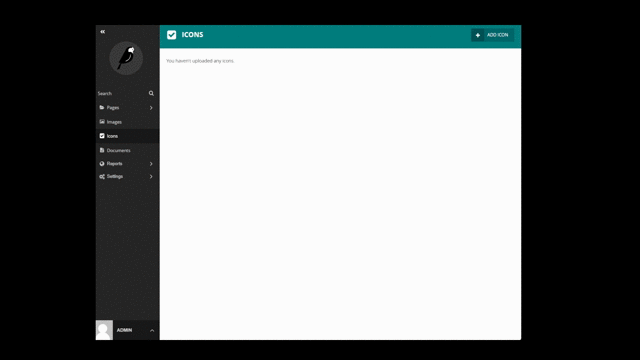

# Wagtail Icons
Wagtail Icons is package that allows you to add icons (in svg format) on your page, divide them on groups, resize and style displayed icons.


## Install

```
pip install wagtail-svg-icons
```

Then add `wagtailextraicons` to your installed apps:

```
INSTALLED_APPS = [
    ...
    'wagtail_icons'
]
```

## Usage

#### IconsField and IconsChooserPanel
**IconsField** - Subclass of [ForeignKey](https://docs.djangoproject.com/en/4.1/ref/models/fields/#foreignkey "ForeignKey") Field with many-to-one relationship with Icon model. Have all arguments of [ForeignKey](https://docs.djangoproject.com/en/4.1/ref/models/fields/#foreignkey "ForeignKey") with defaults:
- on_delete=models.SET_NULL
- null=True
- blank=True

Extra (optional) argument:
- group - title or slug of the group from which icons can be choosen. If not specified all available icons will be displayed.

```python
from wagtail.core.models import Page
from wagtail_icons.edit_handlers import IconsChooserPanel
from wagtail_icons.fields import IconsField

class iconsPage(Page):
    template_name = 'yourapp/yourtemplate'
    icon = IconsField(group='example_group_title')

    content_panels = Page.content_panels + [
        IconsChooserPanel('icon'),
    ]
```

#### How to use Icons in templates
The 'icon' tag inserts svg element into page, setting its size and custom_class (if specified). To use 'icon' tag load 'wagtail_icons_tags'
```

```
Icon tag required arguments:
- icon - instance of Icon model

Icon tag optional arguments:
- size - icon resize given in format "HEIGHTxWIDTH"
- class_name - icon class name that can be used to css styling
- color - custom icon color

**Example usage**
```
<!-- Display original size icon -->


<!-- Display icon scaled to width 200 and height 250 -->


<!-- Display icon scaled to width 200 and height 200 and with class 'my-icon'-->


<!-- Display icon scaled to width 200 and height 200 and in color #81b29a-->

```